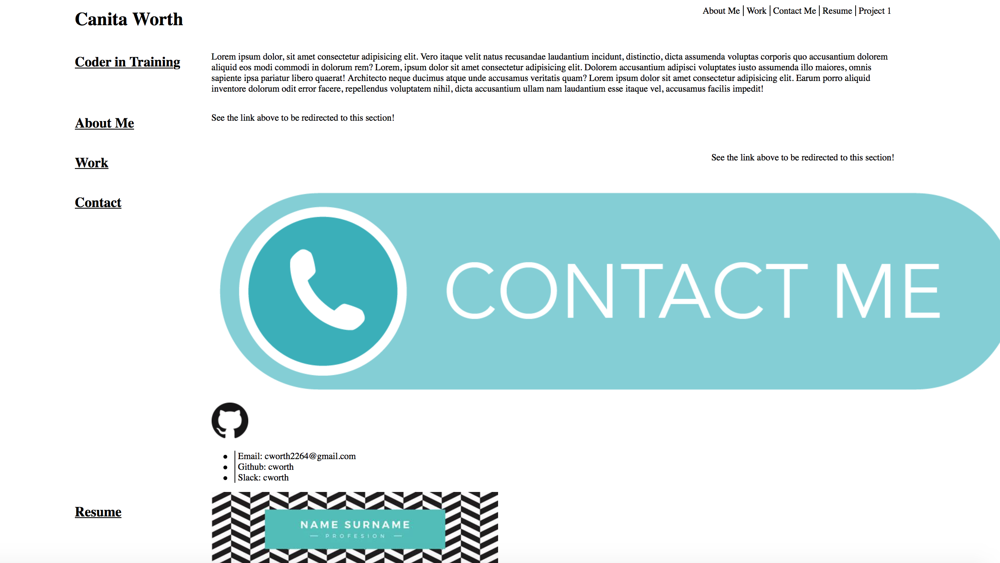

# Updated Portfolio

# Description
For the updated portfolio assignment, I worked on including a link to my Github account, a link to my
LinkedIn account, including a picture of my updated resume, and including examples of work from homework assignments. 
I worked primarily within HTML to update these changes since I had to include links and pages to showcase my work. I also added a separate page to showcase my work from Project 1. When going to the website if you click on the "Project 1" tab at the top, it will take you to a page that displays work from Project 1. 

# Deployed Link:
https://cworth26.github.io/CSS-Portfolio/
# License: 
MIT

# Contact Info:
cworth2264@gmail.com

# Screenshot of website

